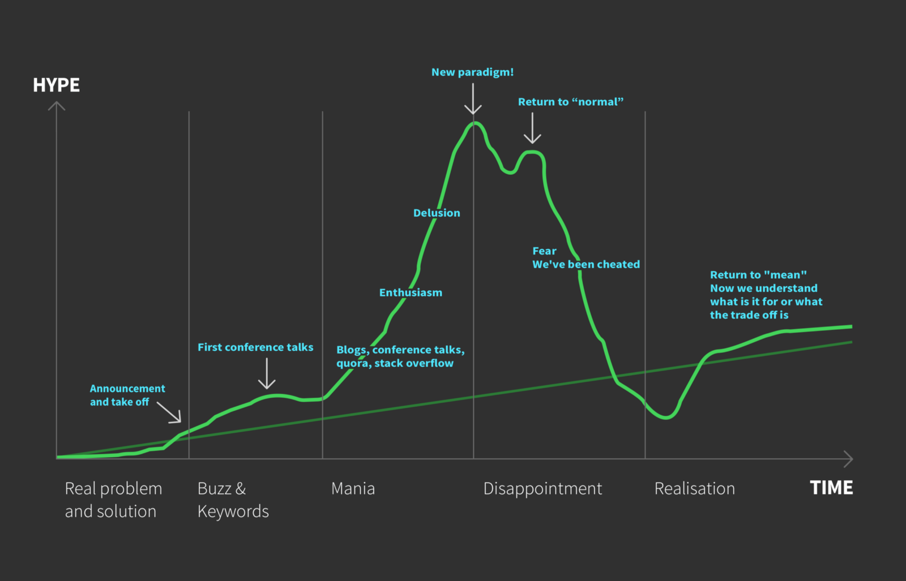

# Titre

## Cartouche d'identification

 - Manifestation : CodeursEnSeine 2018
 - Lieu : Kindarena
 - Conférence : Le marketing de la honte et le code du monde réel 
 - Horaire de la conférence : 11h00
 - Durée de la conférence : 45 mn
 - Conférencier(s) :
   - Quentin Adam, https://twitter.com/waxzce
 - Audience : 100 personnes
 - Auteur du billet : Robin Niel
 - Hype driven development, architecture des systèmes d'informations

## Support
 - Lien vers le support (diapos) présenté en conférence : NA
 - Nombre de diapos du support : NA
 - Plan du support : NA

## Résumé

La conférence avait pour sujet principal un concept appelé "hype driven development". Ce phénomène peut être illustré par les conférences techniques qui font briller les yeux de ceux qui les écoutent et qui ne seraient pas forcément applicable dans le monde réel. Quentin Adam commence d'abord en posant le fait que les choix fait par les humains ne sont **pas rationnels**, nous ne sommes pas des êtres guidés par les données. Ainsi les **choix techniques** que nous faisons ne seront pas forcément purement rationnels mais influencés par les émotions. Ce que rajoute Quentin Adam est le fait que de nombreuses plateformes internet sont maintenant devenues des éditeurs de logigicel (ex : Amazon, Facebook, Google, etc...) et que les technologies que celles-ci proposent ne sont pas toujours celles qui sont utilisées en interne. Une phrase résumant bien la situation est *"tout le monde compare son interne à l'externe des autres"*. Le point important de la conférence est de **ne pas avoir honte** des compromis réalisés en interne mais de comprendre pourquoi ces compromis sont nécessaires dans le contexte propre à l'entreprise. Cela passe par ne pas comparer son interne à celui des autres car le contexte est différent d'une structure à une autre. 

## Architecture et facteur qualité
 
Selon moi le facteur qualité pouvant le plus être influencé par cette conférence est le facteur **"Efficacité"**. Je vais expliciter mon propos avec plusieurs exemples tirés de la conférence.

Le premier exemple concerne Facebook. Au début de Facebook, beaucoup d'utilisateurs commençaient à utiliser la plateforme mais celle-ci n'était pas rentable. En effet, leur backend était du PHP, ce qui est très gourmand en temps CPU, ce qui coûtait cher à Facebook car gourmand en serveur. Pour contrer cela, Facebook développa **HipHop**, un ensemble d'outil permettant d'optimiser le code **PHP**, notamment dans un premier temps, en le transformant en code **C++** beaucoup moins gourmand en temps CPU. A partir de la nuit où Facebook réalisa la migration de PHP à C++, la plateforme devint rentable. Cet exemple illustre un gain d'efficacité remarquable car avec la **même infrastructure** et le **même code PHP**, Facebook a réussi à économiser beaucoup de temps CPU et donc d'argent. Ceci se rapporte au propos de la conférence dans le sens où ce que Facebook réalisa n'aurait pas forcément convenu à une autre entreprise mais leur choix se basa sur **leurs** contraintes.

Le deuxième exemple est celui du goulet d'étranglement que représentent les entrées/sorties. En effet, dans la plupart des systèmes informatiques, le facteur limitant se trouve être les **entrées/sorties** (ex : il faut un certain temps pour requêter une base de données, le réseau ne peut pas transporter plus d'une certaines quantité par seconde, etc...). Quentin Adam prend comme exemple une comparaison entre les temps d'accès mémoire et le temps réel afin de faire sentir la différence temporelle énorme entre le temps d'accès à une donnée stockée dans le registre du **CPU** et une donnée stockée dans la **RAM**. Il est inutile d'après lui de chercher à optimiser un code à la nanoseconde près si les entrées/sorties liées à ce code sont déstinées à le limiter. On revient encore une fois à la notion de compromis interne.

On voit à travers ces deux exemples que le facteur **"Efficacité"** est impacté par les choix techniques réalisés mais que ces choix ne seront jamais réalisés de façon purement rationnels. Le sujet principal de la conférence était d'éclairer l'audience sur comment réaliser ces choix malgré les problèmes courants de l'informatique moderne ainsi que les stratégies de communication de certains éditeurs logiciels. Mais d'autres thèmes plus vastes concernant l'informatique en tant que science et ses problématiques propres ont été évoqués mais ne peuvent pas être retranscrits ici. 
